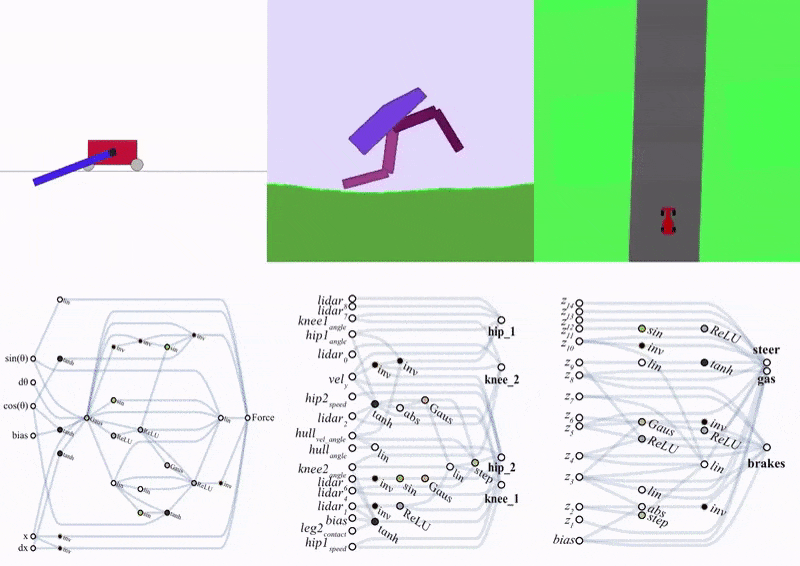
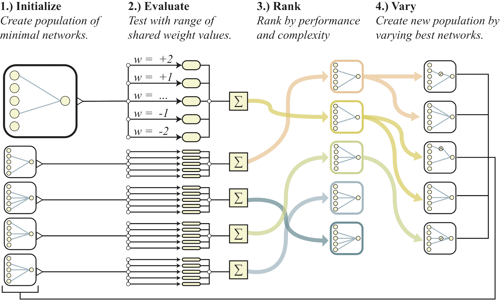
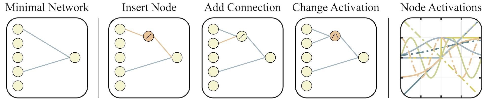

# WANN (Weight Agnostic Neural Network)

<!--
<div style="text-align: center">
 
</div>
%, auto
-->

<div style="text-align: center">
 
</div>

## Description

Adam Gaier（Bonn-Rhein-Sieg University of Applied Sciences）とDavid Ha（Google Brain）が出した論文である。

近年の様々な分野に影響を与えているNN（Neural Network）は、
構造を固定し、重みパラメータを最適化することによって、
特定のタスクを実行できるNNを構築している。

しかし、本論文では、
<font color="DeepPink">重みパラメータを学習することなく</font>、
タスクを実行できるNNを構築していると言う特徴がある。

そして、WANNを用いて強化学習タスクや教師あり学習（MNIST）での有効性を実証している。

本来、人を含め生物の神経回路は、

1. 多種多様な神経細胞を生み出す（細胞分化・発生期）
1. 神経の配線を作る（軸索の伸長）
1. 神経間の結合を作る（シナプス形成）
1. 機能的な回路へ作り替える（活動依存性の修飾）

と言うような過程を経て、柔軟な回路が構成されている。

よって、重みパラメータを最適化すると言う現在のNNは、
生物の神経回路をモデルにしたと言う観点から見ると、離れたところに来ていると考えられる。

人のような、様々なタスクを実行できる柔軟なNNを構築するためには、
重みパラメータを最適化するNNには限界があるのではないだろうか。
そういった意味では、WANNは汎用的な人工知能の実現の礎となるような研究なのではないかと、
私は考えている。


<div style="text-align: center">
 
</div>


## Algorithm
<div style="text-align: center">
 
</div>

<div style="text-align: center">
 
</div>

## for test code

### env
miniforge3 (M1 mac (Arm))

### requirements

on the requirements.yaml

```shell
conda create -n {env_name} python=3.8
conda env create -f requirements.yaml
```

**WARNING**: This command can be run ↓ 
```shell
python3 wann_test.py -p p/swingup.json -i champions/swing.out --nReps 3 --view True
```
Not all other tests have been confirmed.
It may not work due to the version of packages.

# Ref
1. [HomePage](https://weightagnostic.github.io)
2. [arxiv](https://arxiv.org/abs/1906.04358)
3. [brain-tokyo-workshop](https://github.com/google/brain-tokyo-workshop/tree/master/WANNRelease)
4. [Weight Agnostic Neural Network](https://github.com/weightagnostic)
5. [脳の更なる理解への融合研究 統合的神経回路リサーチユニット in 筑波大学](https://ura.sec.tsukuba.ac.jp/archives/6719)
