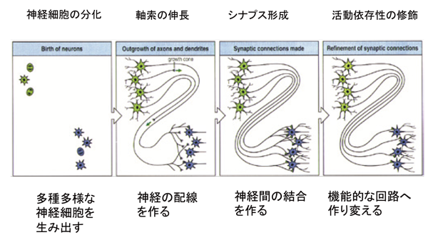

# WANN (Weight Agnostic Neural Network)

<!--
<div style="text-align: center">
 
</div>
%, auto
-->

<div style="text-align: center">
 
</div>

## env
miniforge3 (M1 mac (Arm))

## requirements

on the requirements.yaml

```shell
conda create -n {env_name} python=3.8
conda env create -f requirements.yaml
```

**WARNING**: This command can be run ↓ 
```shell
python3 wann_test.py -p p/swingup.json -i champions/swing.out --nReps 3 --view True
```
Not all other tests have been confirmed.
It may not work due to the version of packages.

# Ref
- [1]: [HomePage](https://weightagnostic.github.io)
- [2]: [arxiv](https://arxiv.org/abs/1906.04358)
- [3]: [brain-tokyo-workshop](https://github.com/google/brain-tokyo-workshop/tree/master/WANNRelease)
- [4]: [Weight Agnostic Neural Network](https://github.com/weightagnostic)
- [5]: [脳の更なる理解への融合研究 統合的神経回路リサーチユニット in 筑波大学](https://ura.sec.tsukuba.ac.jp/archives/6719)
